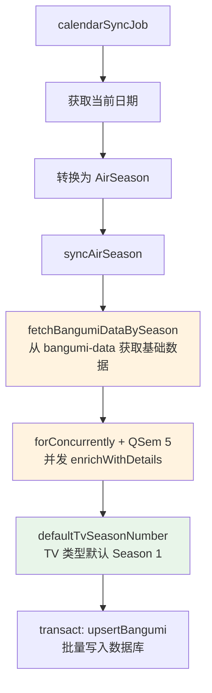
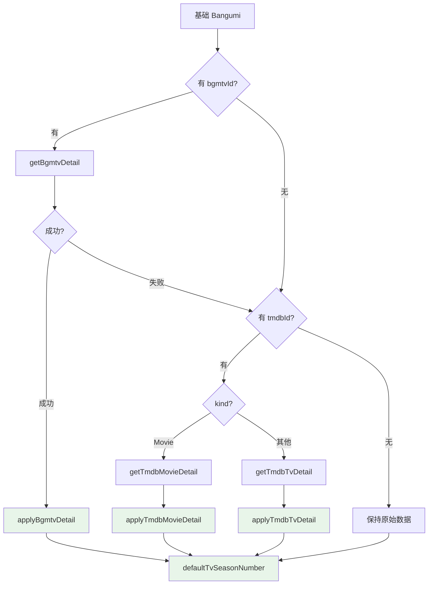

# Calendar

从 [bangumi-data](https://github.com/bangumi-data/bangumi-data/tree/master) 获取数据

## bangumi-data item
```json
 {
    "title": "葬送のフリーレン(第2期)",
    "titleTranslate": {
      "zh-Hans": [
        "葬送的芙莉莲 第二季"
      ],
      "zh-Hant": [
        "葬送的芙莉蓮 第二季"
      ]
    },
    "type": "tv",
    "officialSite": "https://frieren-anime.jp/",
    "begin": "2026-01-16T14:00:00.000Z",
    "end": "",
    "sites": [
      {
        "site": "bangumi",
        "id": "515759"
      },
      {
        "site": "tmdb",
        "id": "tv/209867"
      },
      {
        "site": "mikan",
        "id": "3821"
      }
    ]
  }
  ```

## 整体流程



> 橙色节点为外部 API 调用，绿色节点为纯函数。每次同步都会重新获取并 upsert，不检查已有数据。

## 触发方式

| 触发点   | 时机                                | 入口函数               |
| -------- | ----------------------------------- | ---------------------- |
| 启动时   | 应用启动后立即执行                  | `runInitialSeasonSync` |
| 定时任务 | `0 6 1-10 * *`（每月 1-10 日 6:00） | `runMonthlySync`       |

启动时同步当前季度，定时任务按当前月份推算季度后同步。

## AirSeason 季度划分

```
Winter: 1月 - 3月
Spring: 4月 - 6月
Summer: 7月 - 9月
Fall:   10月 - 12月
```

`airDateToAirSeason` 根据日期所在月份判定季度。

## Enrichment 详情补充

对每条从 bangumi-data 获取的基础 `Bangumi`，依次尝试两个数据源补充详情：



### 各数据源补充的字段

| 字段      | Bgmtv                  | TMDB TV           | TMDB Movie        |
| --------- | ---------------------- | ----------------- | ----------------- |
| posterUrl | posterUrl              | posterPath (W500) | posterPath (W500) |
| titleChs  | titleChs (`orIfEmpty`) | -                 | -                 |
| titleJap  | titleJap               | -                 | -                 |
| season    | season                 | numberOfSeasons   | -                 |

Bgmtv 优先级高于 TMDB，使用 `MaybeT` + `<|>` 做 fallback。`getBgmtvDetail` 返回 `Maybe Bangumi`，通过 `applyBgmtvDetail` 合并字段。

## 数据库操作

- **写入**: `upsertBangumi` -- 按 `bgmtv_id` 做 `INSERT ... ON CONFLICT DO UPDATE`（`transact`）

事务边界：外部 API 调用和 enrichment 在事务外并发执行，仅最终批量写入在事务内。

## 错误处理

- Metadata 层错误（`MetadataError`）通过 `liftError` 提升为 `MoeError`
- 错误由 `runErrorWith` 捕获并记录日志（前缀 `calendar-sync` 或 `initial-sync`）
- Scheduler 层用 `catchAny` 兜底，单次失败不影响后续调度
