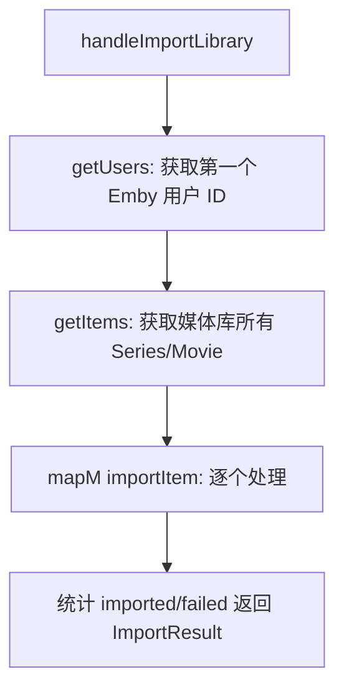
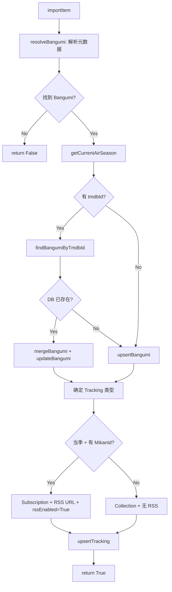

# Emby Import

从 Emby 媒体库导入番剧，自动创建 Bangumi 和 Tracking 记录，并为当季番剧启用 Mikan RSS 订阅。

## API 入口

`POST /api/media/import` (handleImportLibrary)

请求参数：`url` (Emby 地址)、`apiKey`、`libraryId` (媒体库 ID)

## 整体流程



## Emby API 调用链

```
GET /emby/Users?api_key=...
  -> 取第一个用户的 userId

GET /emby/Users/{userId}/Items?ParentId={libraryId}&Recursive=true
    &IncludeItemTypes=Series,Movie&Fields=ProviderIds,PremiereDate,RecursiveItemCount
    &api_key=...
  -> 返回 ItemsResponse { Items: [EmbyItem] }
```

### EmbyItem 关键字段

| Emby JSON 字段 | Haskell 字段 | 用途 |
|----------------|-------------|------|
| Name | name | 番剧名称，用于搜索元数据 |
| Type | itemType | "Series" 或 "Movie" |
| PremiereDate | premiereDate | 首播日期，辅助 TMDB/Bgmtv 搜索 |
| ProviderIds.Tmdb | providerIds | 直接匹配 TMDB ID |
| RecursiveItemCount | recursiveItemCount | Series 下总集数 -> `currentEpisode` |
| UserData.UnplayedItemCount | userData.unplayedItemCount | 未播放集数（当前未使用） |

## 单个 Item 导入 (importItem)



## 元数据解析 (resolveBangumi)

优先级：

1. **ProviderIds.Tmdb** -> 直接通过 TMDB ID 查详情 (getTmdbTvDetail / getTmdbMovieDetail)
2. **TMDB 搜索** -> 按名称 + 首播日期搜索 (searchTmdb)
3. **Bgmtv 搜索** -> TMDB 无结果时回退 (searchBgmtv)

## Bangumi Upsert 策略

当 DB 中已存在相同 tmdbId 的 Bangumi 时，执行 `mergeBangumi`：

- 保留已有的 `titleChs`、`airDate`、`kind`
- 对其余字段（`titleJap`、`season`、`mikanId`、`bgmtvId`、`posterUrl`、`totalEpisodes`）取 `existing <|> new`，即已有值优先

## Tracking Upsert 策略

`upsertTracking` 使用 `ON CONFLICT (bangumi_id) DO UPDATE`：

| 字段 | 冲突时行为 |
|------|-----------|
| currentEpisode | `MAX(existing, new)` -- 只增不减 |
| trackingType | 覆盖为新值 |
| rssUrl | 覆盖为新值 |
| rssEnabled | 覆盖为新值 |
| 其余字段 | 覆盖为新值 |

`currentEpisode` 来源于 Emby 的 `RecursiveItemCount`（该 Series 下的实际集数），`MAX` 保证不会因重新导入而倒退。

## 当季自动订阅

导入时判断是否为当季番剧：

```
getAirSeason bangumi == getCurrentAirSeason
  && bangumi.mikanId 存在
```

满足条件时自动设置：
- `trackingType = Subscription`
- `rssUrl = https://mikanani.me/RSS/Bangumi?bangumiId={mikanId}`
- `rssEnabled = True`

不满足时设为 `Collection`（仅记录，不订阅）。

## 模块结构

```
Moe/Infra/Media/
  Emby/
    API.hs          -- Servant API 类型定义 (EmbyRoutes)
    Types.hs        -- Emby JSON 响应类型 + toMediaItem 转换
  Types.hs          -- MediaItem / MediaLibrary / MediaClientError
  Client.hs         -- Servant Client 封装 (getItems, getUsers, ...)
  Effect.hs         -- Effect 定义
  Adapter.hs        -- Effect 解释器

Moe/Web/API/
  Media/Handler.hs  -- handleImportLibrary / importItem / resolveBangumi
  DTO/Media.hs      -- ImportLibraryRequest / ImportResult
```
