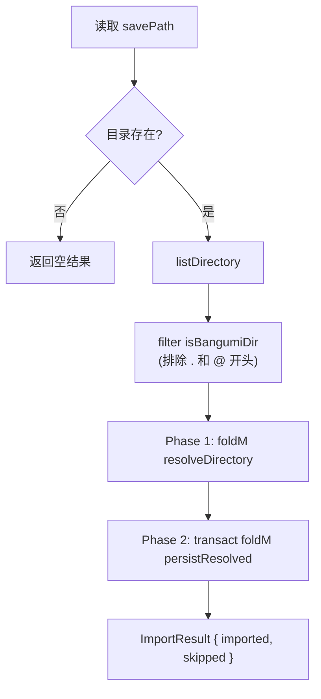
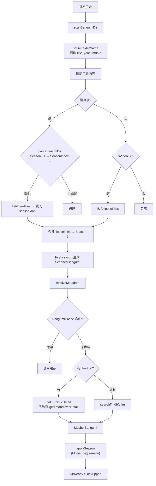
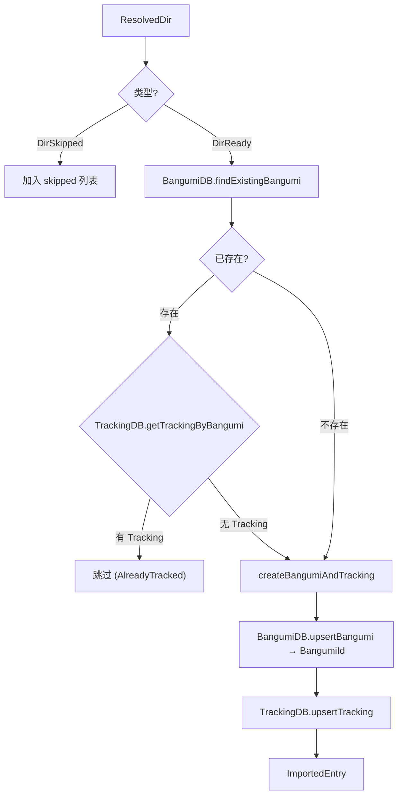

# Import Scan

扫描下载器 savePath 中已有的番剧目录，自动识别元数据并导入 Bangumi + Tracking 记录。

## 触发方式

`POST /api/import/scan` → `importExistingBangumi`

手动触发，扫描结果通过 API 返回给前端展示。

## 整体流程

两阶段设计：Phase 1 做 IO 密集的文件扫描和 TMDB 元数据解析，Phase 2 在单次事务中批量持久化。



## Phase 1: 文件扫描 + TMDB 解析

对每个番剧目录，扫描文件结构并通过 TMDB 获取元数据。使用 `BangumiCache` 避免同一标题重复查询 TMDB。



### parseFolderName 解析规则

支持 Plex/Jellyfin 风格的目录命名：

| 输入 | title | year | tmdbId |
|------|-------|------|--------|
| `葬送的芙莉莲 (2023)` | 葬送的芙莉莲 | 2023 | — |
| `葬送的芙莉莲 (2023) {tmdb-120089}` | 葬送的芙莉莲 | 2023 | 120089 |
| `葬送的芙莉莲` | 葬送的芙莉莲 | — | — |

### 目录结构识别

```
savePath/
├── 葬送的芙莉莲 (2023)/          ← parseFolderName 解析
│   ├── Season 01/                ← parseSeasonDir → SeasonIndex 1
│   │   ├── Frieren - S01E01.mkv  ← video file
│   │   └── Frieren - S01E02.mkv
│   ├── Season 02/                ← SeasonIndex 2
│   │   └── ...
│   └── movie.mkv                 ← loose file → Season 1
├── .hidden/                      ← isBangumiDir 过滤掉
└── @recycle/                     ← isBangumiDir 过滤掉
```

## Phase 2: 事务持久化

所有扫描结果在单次 SQLite 事务中处理。



### Tracking 记录默认值

导入时创建的 Tracking 记录：

| 字段 | 值 | 说明 |
|------|-----|------|
| `trackingType` | `Collection` | 非 RSS 订阅 |
| `rssEnabled` | `False` | SQLite 触发器强制 |
| `currentEpisode` | `0` | — |
| `episodeOffset` | `0` | — |
| `isBDrip` | `False` | — |
| `autoComplete` | `True` | — |
| `rssUrl` | `Nothing` | — |

### Bangumi 去重策略

`upsertBangumi` 按以下优先级去重：

1. 若有 `bgmtvId` → `ON CONFLICT (bgmtv_id) DO UPDATE`
2. 否则 → `findExistingBangumi`：
   - 先按 `tmdb_id + air_date` 匹配
   - 再按 `title_chs + air_date` 匹配
   - 均未匹配 → 创建新记录

## API 响应

```json
{
  "imported": [
    { "bangumiId": 42, "title": "葬送的芙莉莲", "posterUrl": "https://..." }
  ],
  "skipped": [
    { "folderName": "@recycle", "reason": "no video files found" },
    { "folderName": "已订阅的番", "reason": "already tracked" },
    { "folderName": "未知番剧", "reason": "TMDB search failed" }
  ]
}
```

跳过原因：

| SkipReason | 说明 |
|------------|------|
| `AlreadyTracked` | 该 Bangumi 已有 Tracking 记录 |
| `NoVideoFiles` | 目录内无视频文件 |
| `TmdbSearchFailed` | TMDB 搜索无结果 |

## 模块结构

```
src/Moe/Job/Import/
  Scan.hs              -- importExistingBangumi 入口 + 全部逻辑

src/Moe/Domain/
  File.hs              -- parseFolderName, parseSeasonDir, isBangumiDir
  Bangumi.hs           -- Bangumi, SeasonIndex, TmdbId

src/Moe/Infra/
  Database/Bangumi.hs  -- upsertBangumi, findExistingBangumi
  Database/Tracking.hs -- upsertTracking, getTrackingByBangumi
  Metadata/Effect.hs   -- searchTmdb, getTmdbTvDetail, getTmdbMovieDetail

src/Moe/Web/
  Route/Import.hs      -- POST /api/import/scan handler
```
