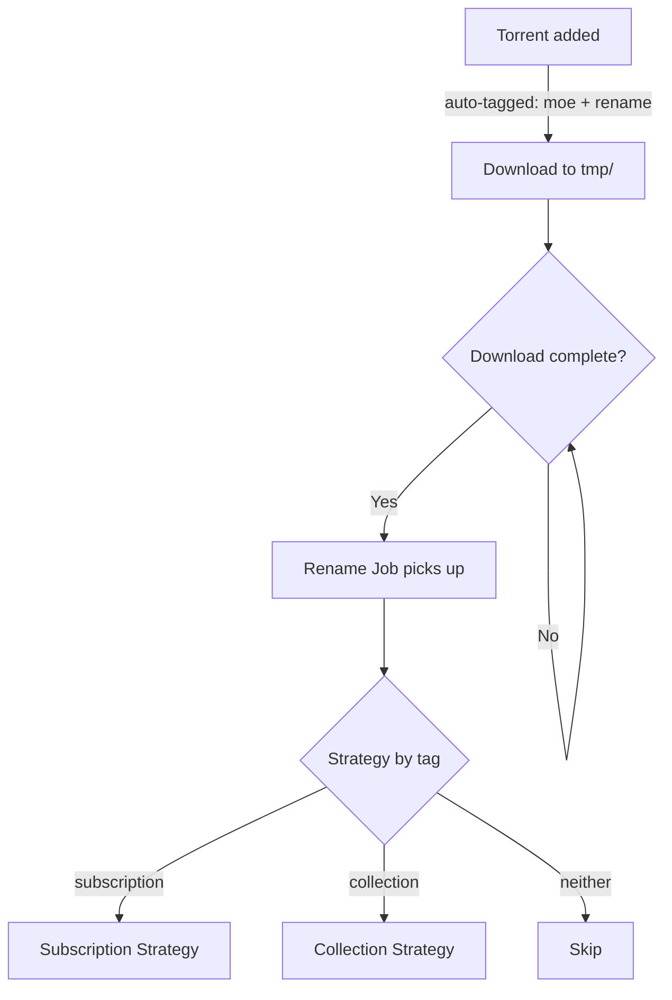
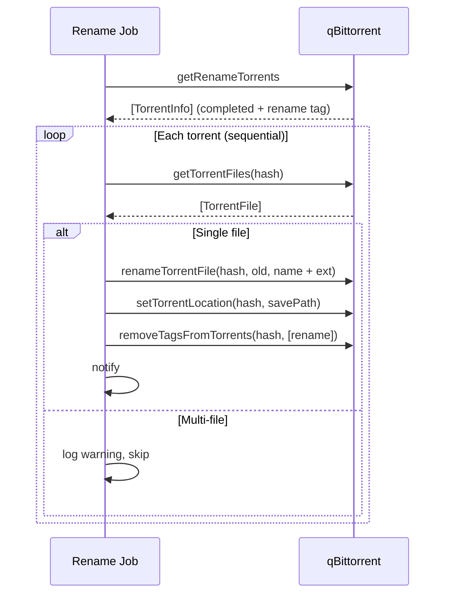
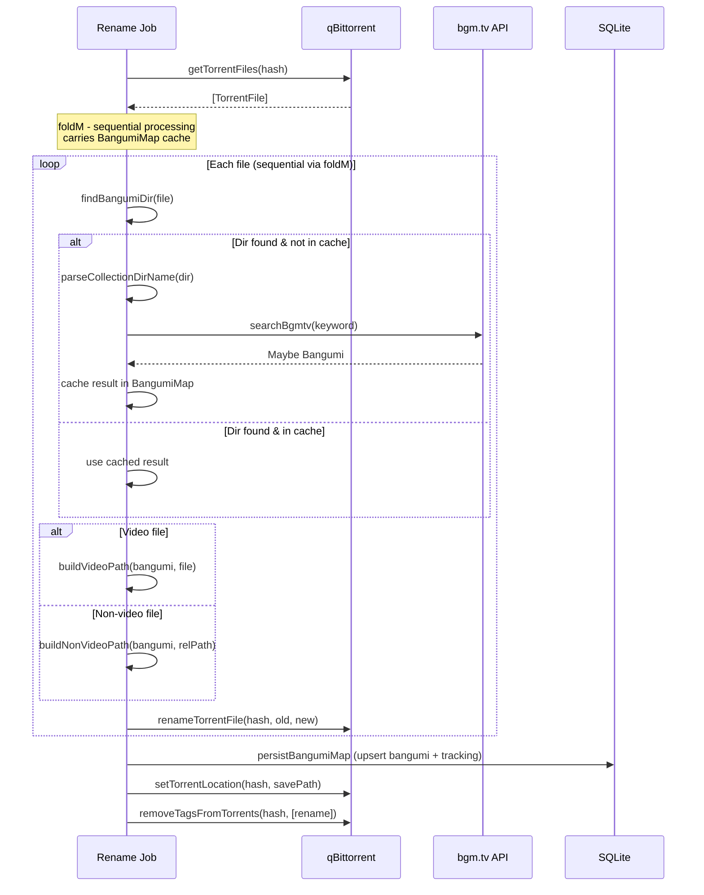
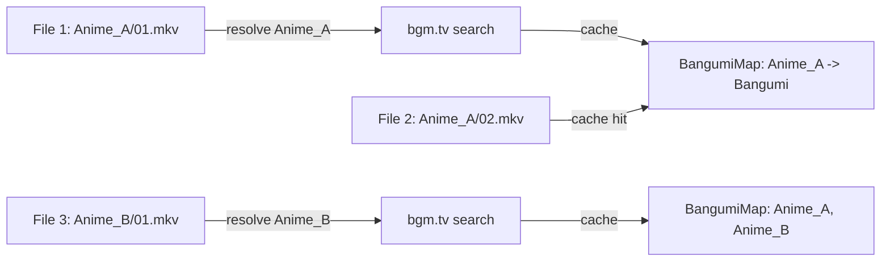
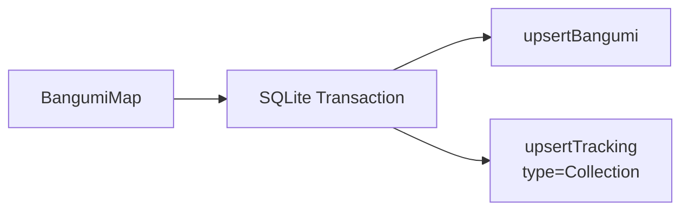
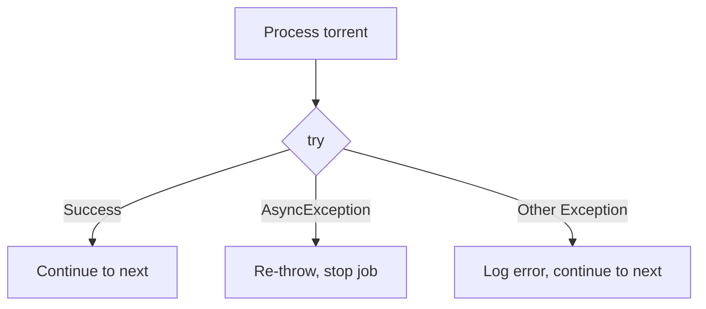

# Rename Flow

Rename job processes completed torrents tagged with `rename`, dispatches to subscription or collection strategy based on tags.

## Overview



## Subscription Strategy

Single-file torrents from RSS. The torrent name is already formatted by the subscription job, only needs file extension appended.



### Path Transformation

```
tmp:   /media/tmp/Title (2025)/Season 01/[Sub] Title - 01.mkv
                                          ^^^^^^^^^^^^^^^^^^^^ old filename

final: /media/bangumi/Title (2025)/Season 01/Title (2025) - S01E01.mkv
                                              ^^^^^^^^^^^^^^^^^^^^^^^^ torrent.name + ext
```

`computeTargetLocation` strips the `tmp` prefix and prepends `savePath`:

```
currentPath: /media/tmp/Title (2025)/Season 01/
tmpBase:     /media/tmp
savePath:    /media/bangumi
result:      /media/bangumi/Title (2025)/Season 01/
```

## Collection Strategy

Multi-file torrents (e.g. BD-Rip collections). Resolves metadata from bgm.tv, renames all files to media server conventions, then persists to database.



### BangumiMap Cache

`foldM` processes files sequentially to carry a `BangumiMap` (metadata cache) between iterations. This avoids redundant bgm.tv API calls for files under the same bangumi directory.



### Video File Classification

```mermaid
flowchart TD
    V[Video file] --> SP{parseSpContent}
    SP -->|ExtraContent: NCOP, NCED, PV...| EX[/extras]
    SP -->|SpecialEpisode: SP01| S0[/Season 00]
    SP -->|Nothing| PI[parseInfo]
    PI --> EP[/Season XX]
```

### Naming Convention

Rename output follows media server conventions (Plex/Emby/Jellyfin):

| Type            | Directory       | Filename Format                   | Example                               |
| --------------- | --------------- | --------------------------------- | ------------------------------------- |
| Regular Episode | `/Season XX`    | `Title - SxxExx [Group].mkv`      | `Frieren - S01E01 [SubGroup].mkv`     |
| Special         | `/Season 00`    | `Title - S00Exx [Group].mkv`      | `Frieren - S00E01 [SubGroup].mkv`     |
| NCOP            | `/extras`       | `NCOPx.mkv`                       | `NCOP1.mkv`                           |
| NCED            | `/extras`       | `NCEDx.mkv`                       | `NCED1.mkv`                           |
| Menu            | `/extras`       | `Menu.mkv`                        | `Menu.mkv`, `Menu Vol.1.mkv`          |
| PV              | `/trailers`     | `PVx.mkv`                         | `PV1.mkv`                             |
| Preview         | `/trailers`     | `Preview.mkv`                     | `Preview.mkv`                         |
| Trailer         | `/trailers`     | `Trailer.mkv`                     | `Trailer.mkv`                         |
| CM              | `/trailers`     | `CMx.mkv`                         | `CM1.mkv`                             |
| Movie           | `/Title (Year)` | `Title (Year).mkv`                | `Frieren Movie (2024).mkv`            |
| Subtitle        | Same as video   | `Title - SxxExx [Group].lang.ext` | `Frieren - S01E01 [SubGroup].zh-Hans.srt` |

Cds, Scans 等非视频目录不处理，直接移动。

### Special Directories (Skipped)

Files in these directories are not treated as bangumi content:

`cds` `cd` `sps` `sp` `scans` `scan` `menu` `menus` `fonts` `font` `extras` `extra` `trailers` `trailer` `pvs` `pv` `specials` `special` `bonus` `ost` `soundtrack` `soundtracks`

### Database Persistence

After renaming all files, resolved bangumi are persisted in a single transaction:



## Error Handling



- Each torrent is wrapped in `try @SomeException` -- a failure does not block other torrents
- Async exceptions are re-thrown (cancellation must propagate)
- `notifySafe` catches notification errors independently -- rename succeeds even if notification fails

## Module Map

```
src/Moe/Job/
  Rename.hs              -- Entry point, job definition, subscription strategy
  Rename/
    Collection.hs        -- Collection strategy
    Util.hs              -- computeTargetLocation, notifySafe

src/Moe/Infra/Downloader/
    Effect.hs            -- Downloader effect (renameTorrentFile, setTorrentLocation...)
    Types.hs             -- Tag constants, TorrentInfo, AddTorrentParams
    Adapter.hs           -- qBittorrent implementation
```
