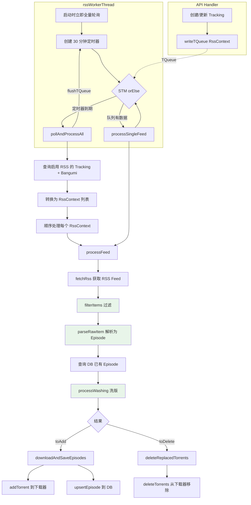
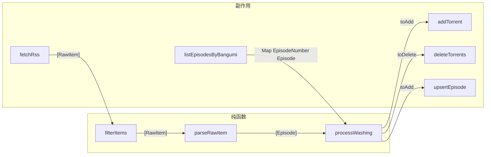
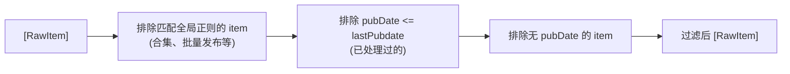
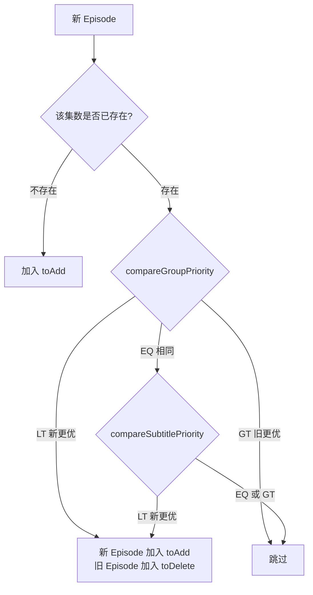

# Subscription

RSS 订阅处理流程，自动下载并按媒体服务器规范组织番剧文件。

## 触发方式

RSS 处理由专用 worker 线程 (`rssWorkerThread`) 统一执行，有两种触发来源：

- **定时轮询**：worker 每 30 分钟调用 `getSubscriptionContexts` 查询当天应处理的订阅
- **Handler 推送**：创建/更新 Tracking 时，`triggerSingleSubscription` 将 `RssContext` 写入 `TQueue`，worker 立即消费

两种来源通过 STM `orElse` 组合：队列有数据立即处理，否则等 30 分钟定时器到期后全量轮询。全量轮询后会清空队列以避免重复。

## 整体流程



> 绿色节点为纯函数，无副作用。

## 单个 RSS 处理 (processFeed)



## Filter 过滤链

`filterItems` 依次执行三个过滤条件：



默认全局正则过滤：`\d+-\d+`（匹配 `01-13` 等合集格式）

## Washing 洗版逻辑

对每个新解析的 Episode，与数据库中已有 Episode 按集数比较：



### shouldUpgrade 判断规则

字幕组优先级为主要判断，字幕语言优先级为次级判断（仅在字幕组优先级相同时生效）。

#### 字幕组优先级 (compareGroupPriority)

根据 `groupPriority` 列表（索引越小优先级越高）。每个 Episode 可能有多个字幕组名，取其中**最优索引**（最小值）进行比较。匹配时忽略大小写，并支持别名匹配。

| 已有字幕组 | 新字幕组 | 结果 |
|-----------|---------|------|
| 空 `[]` | 非空 | LT（升级） |
| 任意 | 空 `[]` | GT（不升级） |
| 相同 | 相同 | EQ（进入字幕判断） |
| 均不在列表 | 均不在列表 | EQ（进入字幕判断） |
| 不在列表 | 在列表 | LT（升级） |
| 在列表 | 不在列表 | GT（不升级） |
| 最优索引 = 2 | 最优索引 = 0 | LT（升级） |
| 最优索引 = 0 | 最优索引 = 2 | GT（不升级） |

#### 字幕语言优先级 (compareSubtitlePriority)

根据 `subtitlePriority` 列表。比较时先对字幕列表排序后再匹配。

默认优先级：`[简日, 简, 繁日, 繁]`

| 已有字幕 | 新字幕 | 结果 |
|---------|-------|------|
| 相同（排序后） | 相同（排序后） | EQ（不升级） |
| 不在列表 | 在列表 | LT（升级） |
| 在列表 | 不在列表 | GT（不升级） |
| 索引 = 2 | 索引 = 0 | LT（升级） |
| 索引 = 0 | 索引 = 2 | GT（不升级） |
| 均不在列表 | 均不在列表 | EQ（不升级） |

## 文件命名

下载时通过 `toBangumiFile` 生成符合媒体服务器规范的路径：

```
savePath: 金牌得主 (2025)/Season 01/
fileName: 金牌得主 - S01E03 [喵萌奶茶屋] [LoliHouse].mkv
```

## 模块结构

```
Job/Subscription.hs          -- Re-export 模块
Job/Subscription/
  Types.hs                   -- RssContext 类型定义
  Filter.hs                  -- RSS item 过滤（纯函数）
  Washing.hs                 -- 洗版逻辑（纯函数）
  Download.hs                -- 下载与删除 torrent
  Process.hs                 -- processFeed 流程编排 + triggerSingleSubscription
  Worker.hs                  -- RSS worker 线程（TQueue + 定时轮询）
```
