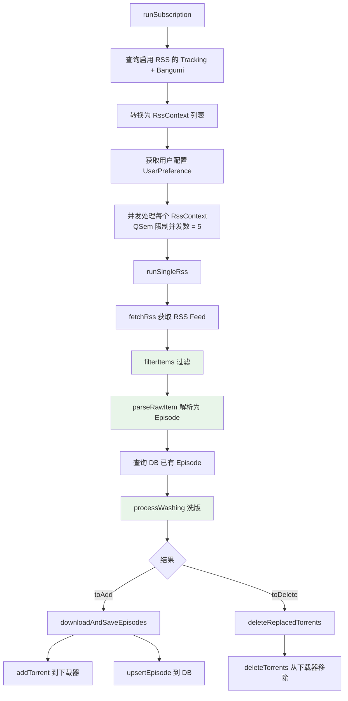
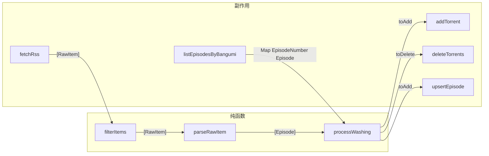
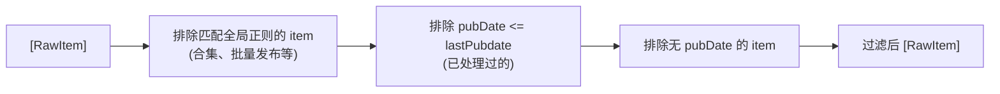
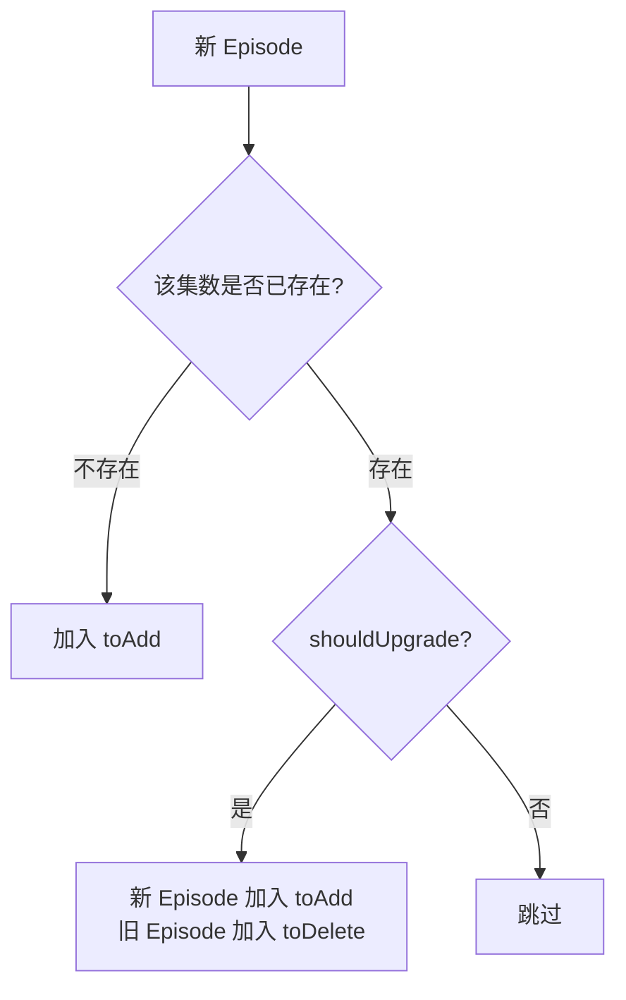

# Subscription

RSS 订阅处理流程，自动下载并按媒体服务器规范组织番剧文件。

## 整体流程


```mermaid
flowchart TD
    A[runSubscription] --> B[查询启用 RSS 的 Tracking + Bangumi]
    B --> C[转换为 RssContext 列表]
    C --> D[获取用户配置 UserPreference]
    D --> E[并发处理每个 RssContext<br/>QSem 限制并发数 = 5]

    E --> F[runSingleRss]

    F --> G[fetchRss 获取 RSS Feed]
    G --> H[filterItems 过滤]
    H --> I[parseRawItem 解析为 Episode]
    I --> J[查询 DB 已有 Episode]
    J --> K[processWashing 洗版]
    K --> L{结果}

    L -->|toAdd| M[downloadAndSaveEpisodes]
    L -->|toDelete| N[deleteReplacedTorrents]

    M --> O[addTorrent 到下载器]
    M --> P[upsertEpisode 到 DB]
    N --> Q[deleteTorrents 从下载器移除]

    style H fill:#e8f5e9
    style I fill:#e8f5e9
    style K fill:#e8f5e9
```

> 绿色节点为纯函数，无副作用。

## 单个 RSS 处理 (runSingleRss)


```mermaid
flowchart LR
    subgraph Pure ["纯函数"]
        direction TB
        Filter[filterItems]
        Parse[parseRawItem]
        Wash[processWashing]
    end

    subgraph Effect ["副作用"]
        direction TB
        Fetch[fetchRss]
        QueryDB[listEpisodesByBangumi]
        Download[addTorrent]
        Delete[deleteTorrents]
        Save[upsertEpisode]
    end

    Fetch -->|"[RawItem]"| Filter
    Filter -->|"[RawItem]"| Parse
    Parse -->|"[Episode]"| Wash
    QueryDB -->|"Map EpisodeNumber Episode"| Wash
    Wash -->|toAdd| Download
    Wash -->|toAdd| Save
    Wash -->|toDelete| Delete
```

## Filter 过滤链

`filterItems` 依次执行三个过滤条件：


```mermaid
flowchart LR
    A["[RawItem]"] --> B["排除匹配全局正则的 item<br/>(合集、批量发布等)"]
    B --> C["排除 pubDate <= lastPubdate<br/>(已处理过的)"]
    C --> D["排除无 pubDate 的 item"]
    D --> E["过滤后 [RawItem]"]
```

默认全局正则过滤：`\d+-\d+`（匹配 `01-13` 等合集格式）

## Washing 洗版逻辑

对每个新解析的 Episode，与数据库中已有 Episode 按集数比较：


```mermaid
flowchart TD
    A[新 Episode] --> B{该集数是否已存在?}
    B -->|不存在| C[加入 toAdd]
    B -->|存在| D{shouldUpgrade?}
    D -->|是| E[新 Episode 加入 toAdd<br/>旧 Episode 加入 toDelete]
    D -->|否| F[跳过]
```

### shouldUpgrade 判断规则

根据用户配置的 `groupPriority` 字幕组优先级列表（索引越小优先级越高）：

| 已有字幕组 | 新字幕组 | 结果 |
|-----------|---------|------|
| 空 | 非空 | 升级 |
| 任意 | 空 | 不升级 |
| 相同 | 相同 | 不升级 |
| 不在优先级列表 | 在优先级列表 | 升级 |
| 优先级索引 = 2 | 优先级索引 = 0 | 升级 |
| 优先级索引 = 0 | 优先级索引 = 2 | 不升级 |

## 文件命名

下载时通过 `toBangumiFile` 生成符合媒体服务器规范的路径：

```
savePath: 金牌得主 (2025)/Season 01/
fileName: 金牌得主 - S01E03 [喵萌奶茶屋] [LoliHouse].mkv
```

## 模块结构

```
App/Subscription/
  Types.hs    -- RssContext 类型定义
  Filter.hs   -- RSS item 过滤（纯函数）
  Washing.hs  -- 洗版逻辑（纯函数）
  Run.hs      -- 流程编排（effectful）
```
